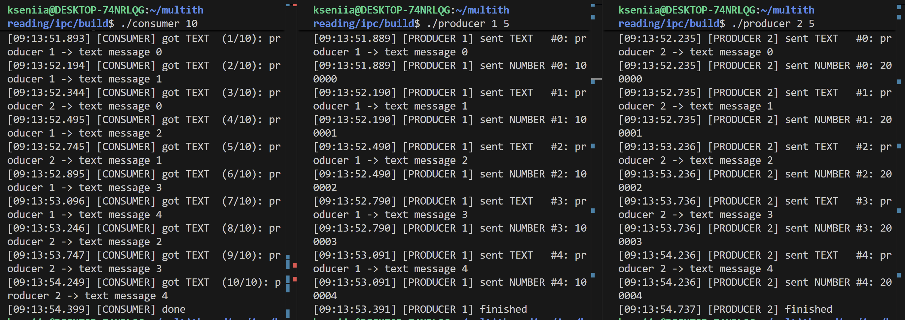

### Запуск consumer

```bash
[09:13:51.541] [CONSUMER] started, waiting for 10 TEXT messages
[09:13:51.893] [CONSUMER] got TEXT  (1/10): producer 1 -> text message 0
[09:13:52.194] [CONSUMER] got TEXT  (2/10): producer 1 -> text message 1
[09:13:52.344] [CONSUMER] got TEXT  (3/10): producer 2 -> text message 0
[09:13:52.495] [CONSUMER] got TEXT  (4/10): producer 1 -> text message 2
[09:13:52.745] [CONSUMER] got TEXT  (5/10): producer 2 -> text message 1
[09:13:52.895] [CONSUMER] got TEXT  (6/10): producer 1 -> text message 3
[09:13:53.096] [CONSUMER] got TEXT  (7/10): producer 1 -> text message 4
[09:13:53.246] [CONSUMER] got TEXT  (8/10): producer 2 -> text message 2
[09:13:53.747] [CONSUMER] got TEXT  (9/10): producer 2 -> text message 3
[09:13:54.249] [CONSUMER] got TEXT  (10/10): producer 2 -> text message 4
[09:13:54.399] [CONSUMER] done
```

### Запуск producer 1
``` bash
[09:13:51.889] [PRODUCER 1] started, delay = 300 ms
[09:13:51.889] [PRODUCER 1] sent TEXT   #0: producer 1 -> text message 0
[09:13:51.889] [PRODUCER 1] sent NUMBER #0: 100000
[09:13:52.190] [PRODUCER 1] sent TEXT   #1: producer 1 -> text message 1
[09:13:52.190] [PRODUCER 1] sent NUMBER #1: 100001
[09:13:52.490] [PRODUCER 1] sent TEXT   #2: producer 1 -> text message 2
[09:13:52.490] [PRODUCER 1] sent NUMBER #2: 100002
[09:13:52.790] [PRODUCER 1] sent TEXT   #3: producer 1 -> text message 3
[09:13:52.790] [PRODUCER 1] sent NUMBER #3: 100003
[09:13:53.091] [PRODUCER 1] sent TEXT   #4: producer 1 -> text message 4
[09:13:53.091] [PRODUCER 1] sent NUMBER #4: 100004
[09:13:53.391] [PRODUCER 1] finished
```

### Запуск producer 2
``` bash
[09:13:52.235] [PRODUCER 2] started, delay = 500 ms
[09:13:52.235] [PRODUCER 2] sent TEXT   #0: producer 2 -> text message 0
[09:13:52.235] [PRODUCER 2] sent NUMBER #0: 200000
[09:13:52.735] [PRODUCER 2] sent TEXT   #1: producer 2 -> text message 1
[09:13:52.735] [PRODUCER 2] sent NUMBER #1: 200001
[09:13:53.236] [PRODUCER 2] sent TEXT   #2: producer 2 -> text message 2
[09:13:53.236] [PRODUCER 2] sent NUMBER #2: 200002
[09:13:53.736] [PRODUCER 2] sent TEXT   #3: producer 2 -> text message 3
[09:13:53.736] [PRODUCER 2] sent NUMBER #3: 200003
[09:13:54.236] [PRODUCER 2] sent TEXT   #4: producer 2 -> text message 4
[09:13:54.236] [PRODUCER 2] sent NUMBER #4: 200004
[09:13:54.737] [PRODUCER 2] finished
```